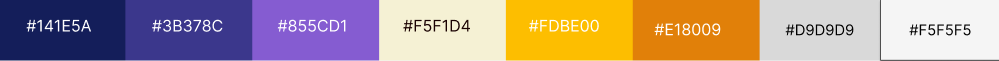

# Template padrão da aplicação

Pré-requisitos: <a href="02-Especificacao.md"> Especificação do projeto</a>, <a href="03-Metodologia.md"> Metodologia</a>, <a href="05-Projeto-interface.md"> Projeto de interface</a>

## Template Padrão

Layout padrão, desenvolvido para dinamizar a navegação do usuário pelas funcionalidades da aplicação. Conta com um menu lateral que oferece acesso rápido a todas as páginas disponíveis, como a página de estoque, onde o usuário pode visualizar e gerenciar seu inventário de ferramentas. Além disso, possui uma barra de pesquisa integrada que facilita a localização de projetos, proporcionando uma experiência de uso mais ágil e intuitiva.

## Paleta de Cores

Esta paleta de cores foi cuidadosamente selecionada para transmitir modernidade, clareza e dinamismo à interface da aplicação. As tonalidades de azul e roxo (#141E5A, #3B378C, #855CD1) criam uma base visual sólida e confiável, ideal para elementos de navegação e cabeçalhos. Os tons quentes de amarelo e laranja (#FDBE00, #E18009) adicionam contraste e vitalidade, sendo ideais para botões de ação e destaques. Já os tons neutros (#F5F1D4, #D9D9D9, #F5F5F5) equilibram o conjunto, oferecendo fundos leves e áreas de respiro visual. Essa combinação garante uma experiência de uso harmoniosa, acessível e visualmente atraente.

## Logo

A logo da Manejo GR representa, de forma simbólica e funcional, a missão da empresa em oferecer um sistema simples, integrado e eficiente para a gestão de recursos e materiais. O engrenamento central simboliza os processos internos e operacionais das empresas, que demandam organização, controle e fluidez. Ele está envolto por setas circulares, que representam o ciclo contínuo de uso, empréstimo, devolução e controle dos recursos, destacando a natureza dinâmica e rotativa dos materiais em setores como Produção e Assistência Técnica.

A cor laranja vibrante foi escolhida por transmitir energia, ação e modernidade, além de reforçar o compromisso com a inovação e a produtividade. Os dizeres “Manejo” e “Gestão de Recursos”, dispostos ao redor do símbolo, reforçam visualmente a proposta da solução: promover o uso racional, controlado e inteligente de materiais, substituindo métodos ultrapassados como anotações manuais ou planilhas pouco funcionais.

Essa identidade visual traduz os princípios da empresa, alinhando-se à necessidade do público-alvo — pequenas e médias empresas que buscam eficiência, segurança de dados e simplicidade no controle de seus ativos. A logo não é apenas um símbolo gráfico, mas um reflexo da proposta da Manejo GR de transformar a gestão de recursos em um processo intuitivo, confiável e acessível.

## Tipografia
A fonte Roboto foi escolhida como tipografia principal da aplicação por reunir características essenciais para uma interface moderna, funcional e acessível. Desenvolvida com foco na legibilidade e na versatilidade, Roboto apresenta traços limpos e proporções equilibradas, facilitando a leitura em diferentes tamanhos e resoluções de tela.

Sua estrutura sem serifa transmite uma sensação de simplicidade e objetividade, alinhando-se perfeitamente ao propósito da Manejo GR de oferecer uma solução clara, direta e fácil de utilizar. Além disso, sua ampla variedade de pesos (fino, regular, médio, negrito) permite a criação de hierarquias visuais bem definidas, contribuindo para uma navegação mais fluida e organizada.

A escolha da Roboto também se justifica pela sua ampla compatibilidade com navegadores e dispositivos, garantindo consistência visual em diferentes plataformas. Essa tipografia reforça o compromisso da aplicação com a acessibilidade e a usabilidade, valores centrais para atender às necessidades de pequenas e médias empresas que buscam eficiência sem abrir mão de uma experiência agradável e intuitiva.
